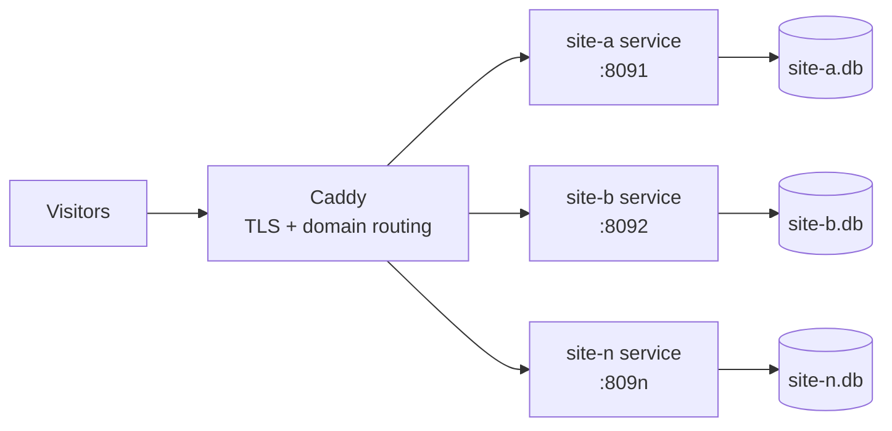

# Composure: Go CMS architecture plan

Sep 24, 2026 · @Mark Labrecque

This is the technical starting point. The [product requirements document](prd.md) controls v1 scope where later decisions differ from this plan.

## Context and goals

Build a tightly scoped CMS as a personal project for content sites. It is intended as a smaller alternative to WordPress for sites that do not need its plugin ecosystem.

WordPress's exposure comes mostly from its PHP runtime and third-party plugin ecosystem. The new CMS removes both: a compiled binary with no plugin marketplace and a small, reviewed codebase.

Design drivers, in priority order:

- **Security:** minimal runtime attack surface, no third-party plugins.
- **Performance:** fast server-rendered pages on modest hardware.
- **Maintainability:** few dependencies, trivial deploys, low upgrade churn.
- **Agent-first:** small surface area, strong typing and fast tests, so coding agents can add extensions safely.

## Stack decision

Decision: a fully custom CMS in Go, built mostly on the standard library, with SQLite storage and server-rendered pages via `html/template`. No framework we don't control and no Node runtime or normal application build. A pinned prebuilt rich-text bundle is allowed; updating it may use upstream Node tooling.

| Layer | Choice | Why |
| --- | --- | --- |
| Language | Go | Single static binary, strong typing, fast tests, little dependency churn |
| HTTP | Standard library `net/http` router | Method and path patterns built in; no framework lock-in |
| Database | SQLite in WAL mode | No separate database server, one file per site, ample for editor-driven writes |
| Schema | Code-owned tables/migrations; JSON field documents per draft/snapshot | Runtime types do not issue DDL; transactional reference and path indexes support queries |
| Rendering | Go `html/template` | Server-rendered HTML for both the public site and the admin |
| Reverse proxy | Caddy | Automatic Let's Encrypt TLS, domain routing in a few lines |
| Process manager | systemd | One service per site, restarts on failure |

PocketBase was evaluated and dropped. Its admin UI is a developer-facing panel that can't be rebranded, renamed or simplified for editors, and its core schema can't be changed. Once we build our own admin anyway, it adds more constraints than value.

**Other alternatives considered**

- **Hugo:** good for sites that can be fully static.
- **Directus / Strapi:** capable, but bring Node into the stack.

## Admin UI

The admin is a first-class product feature, built for editors rather than developers. It is the main reason for building custom.

Requirements:

- **Plain-language naming:** labels, content type names and help text set per site in config ("News story", not "collection").
- **Show only what editors need:** per-type field ordering, grouping and hidden system fields.
- **Brandable:** site logo and colours via CSS variables, with a polished shared base theme.
- **Server-rendered:** Go templates plus light progressive enhancement (for example htmx or small vanilla JS), no SPA build.
- **Consistent screens:** list, edit and preview generated from the content model, so new types get a usable admin for free. A media library is on the roadmap after v1.

## Build scope and effort

The former 21–34 day estimate is withdrawn. It predates most of the PRD and is not a useful schedule. The PRD now defers partial portable exports/imports and ranks further cut candidates; the remaining P0 features still gate release. Re-estimate after the Page journey and again after the first full editorial workflow, including security review and operations work.

Auth and file handling are the pieces most often underestimated. Treat security-sensitive code as human-reviewed, even when an agent writes it.

## Storage and configuration decisions

The [runtime content and deployment decision](adr/0001-runtime-content-and-deployment.md) fixes JSON storage, supported model changes, production configuration locking, file retention and rollback safety. The [Page contract](phase1/content-contract.md) gives the initial schema. Configuration editing happens in development/staging, with Git-reviewed explicit deployment to production; active SQLite configuration is the deployed copy.

Release builds remain CGO_ENABLED=0. Images use standard-library JPEG/PNG encoding, golang.org/x/image/webp decoding and golang.org/x/image/draw resizing. WebP input becomes PNG. Pin these dependencies when media lands, enforce decode budgets and use one image worker per site initially. Generate required variants before publication, never on visitor requests.

## Database strategy

Ship SQLite only, one database per site. Do not build a Postgres adapter until a site needs it.

Sharing a database across sites is out of scope. Content-site writes mainly come from editors saving pages, which SQLite in WAL mode can handle.

Two adapters would double every query path, migration and test, making the codebase harder for agents to work in. Keep data access behind a repository interface so Postgres can be added later without a rewrite.

**Triggers for moving a site to Postgres**

- Visitor-path writes at volume: busy forms, per-pageview analytics or event logging, comments on a high-traffic site.
- Scale-out: more than one app server sharing state behind a load balancer.
- Compliance needs such as managed backups or replication.

Rule of thumb: if writes come from visitors rather than editors, evaluate Postgres.

## Hosting and deployment

Each site runs as its own process with its own SQLite file on a Hetzner host, with Caddy routing by domain.

The Go binary is its own web server. There is no PHP-FPM pool, document root or `.htaccess`: systemd keeps the binary alive and the proxy passes traffic through.

Caddy terminates TLS and forwards each domain to that site's port. Use separate service users, databases and file directories. Set and measure systemd MemoryMax and CPUQuota per site; process separation alone does not isolate resource consumption. Deploy the protected Page journey in phase 2, then harden recovery in phase 6.

**Why one process per site, not true multi-tenancy**

- A bad deploy or crash affects one site, not all of them.
- Separate databases reduce the risk of a query bug leaking data across sites.
- Sites can be upgraded one at a time.
- Idle Go processes are cheap, so the resource cost is small.

**Deploy flow:** build the binary, validate and compare configuration, create a database rollback snapshot, apply configuration explicitly, start the new release, and check the site. An ordinary service start does not import configuration.

## Cache strategy

Use a bounded in-process HTML cache keyed by path and a transactional site publication generation. Bump the generation on all public-affecting content, menu, redirect and configuration changes. This deliberately invalidates the whole site rather than maintaining a dependency graph. In-flight renders cannot write into a newer generation. Admin/preview are never cached; Caddy and CDN response caching are excluded from acceptance runs. Test publishing and image work under traffic, including two sites sharing the host.

## Performance and scaling

These figures are approximate estimates, to be confirmed by load testing. The PRD sets the v1 release target and requires a test that increases traffic to find the first bottleneck.

| Measure | Approximate figure |
| --- | --- |
| Idle memory per site process | \~20 MB |
| Memory per concurrent request (goroutine) | a few KB |
| Cached-content throughput per process | hundreds to low thousands of req/s |
| Comfortable concurrency per process | a few thousand connections |

Memory grows with active requests and cache size, not with idle sites. The number of sites a host can serve needs measurement against the chosen host size and site mix.

The likely ceiling is SQLite write contention on visitor-write-heavy sites, not Go itself (see Database strategy).

## Local development

Local setup is: run the binary, open the port. No Apache, Nginx or database server is needed locally.

- The binary listens on a local port such as `localhost:8080`; open it in a browser.
- Plain HTTP on localhost is usually fine, since browsers treat localhost as a secure context.
- For trusted HTTPS, reuse the mkcert CA already installed by DDEV: generate a cert for a name like `myapp.localhost` and point the binary's TLS config at the cert and key.
- To mirror production, optionally run Caddy locally as the proxy.

**DDEV:** not required. It can wrap the binary as a custom Docker service for consistent hostnames across Drupal and CMS projects, but running the binary directly is lighter.

## Risks and tradeoffs

| Risk | Impact | Mitigation |
| --- | --- | --- |
| Building auth and sessions ourselves | Security bugs in login, sessions or CSRF | Use vetted libraries (bcrypt/argon2, standard crypto); human review of all auth code |
| File upload handling | Malicious or oversized uploads | Validate type and size, store outside the web root, re-encode images |
| We own all maintenance | No upstream fixes or community plugins | Keep scope tight; strong test suite; agent guidance for extensions |
| Scope creep toward a general-purpose CMS | Effort grows beyond the release plan | Build to the PRD; defer other features |
| SQLite write limits | Visitor-write-heavy sites may contend | Repository interface; Postgres per the triggers above |
| Single host for multiple sites | Hardware failure affects every site on that host | Composure provides full export and restore; the operator handles backup scheduling and off-host storage |
| New Go hosting setup | Slower first deploys | Standardize a systemd and Caddy template per site |

## Next actions

This list is a summary; the work plan owns sequencing and acceptance, including SMTP, redirects, menus, Trash and audit.

- [ ] Establish required CI via #14, activate Go/browser gates as code arrives, and add minimal agent conventions before application implementation.
- [ ] Keep the local Page tracer: Go router and SQLite, rendering one page with `html/template`.
- [ ] Follow the Page contract and storage ADR; define the remaining feature contracts when their phase begins.
- [ ] Build auth and sessions first, with human review before anything else depends on it.
- [ ] Design the admin UI base theme and per-site naming and branding config.
- [ ] Define the repository interface for data access in custom code.
- [ ] Implement drafts and publish-only snapshots as specified in the PRD.
- [ ] Set up local HTTPS with the existing mkcert CA.
- [ ] Deploy the authenticated Page to Hetzner in phase 2 with systemd/Caddy and run a smoke load; harden deployment in phase 6.
- [ ] Build the CLI full export and restore commands; backup scheduling and off-host storage are operator responsibilities.
- [ ] Load test cached and uncached pages on the intended Hetzner host against the PRD targets, then increase traffic to find the first bottleneck.
- [ ] Require independent auth/upload review before client launch, with dependency, static-analysis and fuzz gates alongside human review.
