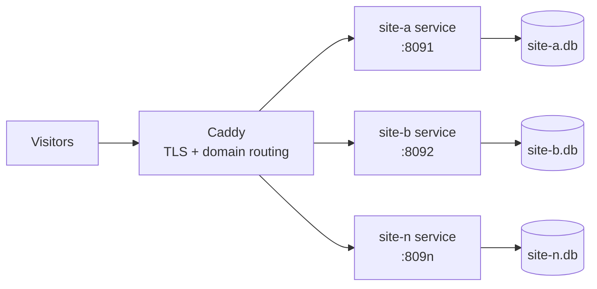

# Composure: Go CMS architecture plan

Sep 24, 2026 · @Mark Labrecque

This is the technical starting point. The [product requirements document](prd.md) controls v1 scope where later decisions differ from this plan.

## Context and goals

Build a tightly scoped CMS as a personal project for content sites. It is intended as a smaller alternative to WordPress for sites that do not need its plugin ecosystem.

WordPress's exposure comes mostly from its PHP runtime and third-party plugin ecosystem. The new CMS removes both: a compiled binary with no plugin marketplace and a small, reviewed codebase.

Design drivers, in priority order:

- **Security:** minimal runtime attack surface, no third-party plugins.
- **Performance:** fast server-rendered pages on modest hardware.
- **Maintainability:** few dependencies, trivial deploys, low upgrade churn.
- **Agent-first:** small surface area, strong typing and fast tests, so coding agents can add extensions safely.

## Stack decision

Decision: a fully custom CMS in Go, built mostly on the standard library, with SQLite storage and server-rendered pages via `html/template`. No framework we don't control, and no Node in the stack.

| Layer | Choice | Why |
| --- | --- | --- |
| Language | Go | Single static binary, strong typing, fast tests, little dependency churn |
| HTTP | Standard library `net/http` router | Method and path patterns built in; no framework lock-in |
| Database | SQLite in WAL mode | No separate database server, one file per site, ample for editor-driven writes |
| Schema | Our own tables and migrations | Naming, versioning and workflow designed for Composure's content model |
| Rendering | Go `html/template` | Server-rendered HTML for both the public site and the admin |
| Reverse proxy | Caddy | Automatic Let's Encrypt TLS, domain routing in a few lines |
| Process manager | systemd | One service per site, restarts on failure |

PocketBase was evaluated and dropped. Its admin UI is a developer-facing panel that can't be rebranded, renamed or simplified for editors, and its core schema can't be changed. Once we build our own admin anyway, it adds more constraints than value.

**Other alternatives considered**

- **Hugo:** good for sites that can be fully static.
- **Directus / Strapi:** capable, but bring Node into the stack.

## Admin UI

The admin is a first-class product feature, built for editors rather than developers. It is the main reason for building custom.

Requirements:

- **Plain-language naming:** labels, content type names and help text set per site in config ("News story", not "collection").
- **Show only what editors need:** per-type field ordering, grouping and hidden system fields.
- **Brandable:** site logo and colours via CSS variables, with a polished shared base theme.
- **Server-rendered:** Go templates plus light progressive enhancement (for example htmx or small vanilla JS), no SPA build.
- **Consistent screens:** list, edit and preview generated from the content model, so new types get a usable admin for free. A media library is on the roadmap after v1.

## Build scope and effort

The original rough effort estimates below predate the detailed PRD and should be replanned for its broader v1 scope. They are not delivery commitments.

| Component | Scope for v1 | Rough effort |
| --- | --- | --- |
| Auth and sessions | Login, password hashing, secure cookies, CSRF, roles (admin, editor) | 3–5 days |
| Content model | Types, fields and relations defined in config; migrations | 3–5 days |
| Admin CRUD screens | Generated list, edit and preview screens per type | 5–8 days |
| Media uploads | Validation, storage, image styles and focal point | 3–4 days |
| Public rendering | Routing, templates, menus, caching | 3–5 days |
| Snapshots and publishing | Draft/published states, publish-only snapshots | 2–4 days |
| Ops tooling | Backups, deploy script, systemd and Caddy templates | 2–3 days |

Auth and file handling are the pieces most often underestimated. Treat security-sensitive code as human-reviewed, even when an agent writes it.

## Database strategy

Ship SQLite only, one database per site. Do not build a Postgres adapter until a site needs it.

Sharing a database across sites is out of scope. Content-site writes mainly come from editors saving pages, which SQLite in WAL mode can handle.

Two adapters would double every query path, migration and test, making the codebase harder for agents to work in. Keep data access behind a repository interface so Postgres can be added later without a rewrite.

**Triggers for moving a site to Postgres**

- Visitor-path writes at volume: busy forms, per-pageview analytics or event logging, comments on a high-traffic site.
- Scale-out: more than one app server sharing state behind a load balancer.
- Compliance needs such as managed backups or replication.

Rule of thumb: if writes come from visitors rather than editors, evaluate Postgres.

## Hosting and deployment

Each site runs as its own process with its own SQLite file on a Hetzner host, with Caddy routing by domain.

The Go binary is its own web server. There is no PHP-FPM pool, document root or `.htaccess`: systemd keeps the binary alive and the proxy passes traffic through.

Caddy terminates TLS and forwards each domain to that site's port.

**Why one process per site, not true multi-tenancy**

- A bad deploy or crash affects one site, not all of them.
- Separate databases reduce the risk of a query bug leaking data across sites.
- Sites can be upgraded one at a time.
- Idle Go processes are cheap, so the resource cost is small.

**Deploy flow:** build the binary, validate and compare configuration, create a database rollback snapshot, apply configuration explicitly, start the new release, and check the site. An ordinary service start does not import configuration.

## Performance and scaling

These figures are approximate estimates, to be confirmed by load testing. The PRD sets the v1 release target and requires a test that increases traffic to find the first bottleneck.

| Measure | Approximate figure |
| --- | --- |
| Idle memory per site process | \~20 MB |
| Memory per concurrent request (goroutine) | a few KB |
| Cached-content throughput per process | hundreds to low thousands of req/s |
| Comfortable concurrency per process | a few thousand connections |

Memory grows with active requests and cache size, not with idle sites. The number of sites a host can serve needs measurement against the chosen host size and site mix.

The likely ceiling is SQLite write contention on visitor-write-heavy sites, not Go itself (see Database strategy).

## Local development

Local setup is: run the binary, open the port. No Apache, Nginx or database server is needed locally.

- The binary listens on a local port such as `localhost:8080`; open it in a browser.
- Plain HTTP on localhost is usually fine, since browsers treat localhost as a secure context.
- For trusted HTTPS, reuse the mkcert CA already installed by DDEV: generate a cert for a name like `myapp.localhost` and point the binary's TLS config at the cert and key.
- To mirror production, optionally run Caddy locally as the proxy.

**DDEV:** not required. It can wrap the binary as a custom Docker service for consistent hostnames across Drupal and CMS projects, but running the binary directly is lighter.

## Risks and tradeoffs

| Risk | Impact | Mitigation |
| --- | --- | --- |
| Building auth and sessions ourselves | Security bugs in login, sessions or CSRF | Use vetted libraries (bcrypt/argon2, standard crypto); human review of all auth code |
| File upload handling | Malicious or oversized uploads | Validate type and size, store outside the web root, re-encode images |
| We own all maintenance | No upstream fixes or community plugins | Keep scope tight; strong test suite; agent guidance for extensions |
| Scope creep toward a general-purpose CMS | Effort grows beyond the release plan | Build to the PRD; defer other features |
| SQLite write limits | Visitor-write-heavy sites may contend | Repository interface; Postgres per the triggers above |
| Single host for multiple sites | Hardware failure affects every site on that host | Composure provides full export and restore; the operator handles backup scheduling and off-host storage |
| New Go hosting setup | Slower first deploys | Standardize a systemd and Caddy template per site |

## Next actions

- [ ] Spike: a Go binary with the standard library router and SQLite, rendering one page with `html/template`.
- [ ] Model the five launch content types and menus in the schema and config format.
- [ ] Build auth and sessions first, with human review before anything else depends on it.
- [ ] Design the admin UI base theme and per-site naming and branding config.
- [ ] Define the repository interface for data access in custom code.
- [ ] Implement drafts and publish-only snapshots as specified in the PRD.
- [ ] Set up local HTTPS with the existing mkcert CA.
- [ ] Write a systemd unit and Caddy config template for one site per port.
- [ ] Build the CLI full export and restore commands; backup scheduling and off-host storage are operator responsibilities.
- [ ] Load test cached and uncached pages on the intended Hetzner host against the PRD targets, then increase traffic to find the first bottleneck.
- [ ] Write agent guidance (conventions, test commands) so agents can add extensions safely.
